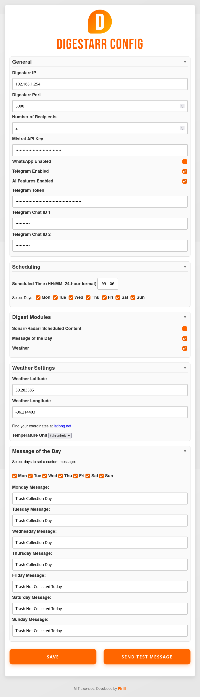
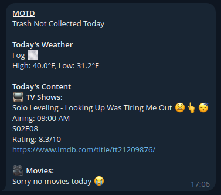

<div align="center">
  
  <h1>Digestarr</h1>
</div>

**Digestarr** (pronounced “di-JEST-arr”) is a Python‑based tool that compiles and sends daily media digests about new TV shows and movies sourced from Sonarr and Radarr for your Plex, Jellyfin, or Emby server. With a user‑friendly Flask configurator, Digestarr simplifies managing API keys, scheduling updates, and delivering notifications via Telegram and WhatsApp (using [ChatMeBot](https://chatmebot.com)).

---

## Features

- **Daily Media Digest:** Automatically compiles and sends daily digests that include:
  - **Media Content:** New TV shows and movies fetched from Sonarr and Radarr, including air times, season/episode details, and IMDb ratings via OMDB.
  - **Weather Forecast:** Displays daily weather information using the Open‑Meteo API.
  - **Message of the Day:** Allows you to set custom daily messages.
  - **News & Headlines:** Retrieves a brief headline for one category each (General, Business, etc.) via NewsAPI.
  - **Crypto/Stock Tickers:** Displays current prices and 24‑hour changes for selected crypto or stock tickers. (Crypto data is retrieved from CoinGecko and stock data from Yahoo’s unofficial API.)
- **Flexible Scheduling:** Configure specific days and times for digest delivery using APScheduler.
- **Multi‑Channel Messaging:** Send notifications via Telegram and WhatsApp.
- **AI Integration (Optional):** Enable AI features (via the Mistral API) to generate emoji enhancements for your digest.
- **User‑Friendly Configurator:** A Flask‑based web interface to manage media hosts, API keys, credentials, module enablement, and scheduling.
- **Planned Third‑Party Modules:** Future support will allow users to create and install third‑party modules to further customize their daily digest experience.

---

## Installation

### Prerequisites

- Python 3.8 or higher
- Git (optional)

### Downloading the Code

#### Using Git

```bash
git clone https://github.com/yourusername/Digestarr.git
cd Digestarr
```

#### Download as ZIP

1. Navigate to the [Digestarr GitHub repository](https://github.com/yourusername/Digestarr).
2. Click the green **Code** button.
3. Select **Download ZIP**.
4. Extract the downloaded ZIP file.

### Setting Up the Virtual Environment

1. **Create a Python Virtual Environment:**

    ```bash
    python -m venv venv
    ```

2. **Activate the Virtual Environment:**

    - On macOS/Linux:

      ```bash
      source venv/bin/activate
      ```

    - On Windows:

      ```bash
      venv\Scripts\activate
      ```

3. **Install Dependencies:**

    ```bash
    pip install -r requirements.txt
    ```

---

## Deployment

To run Digestarr’s configurator continuously in the background on a Debian server, create a systemd service file. For example, create `/etc/systemd/system/digestarr.service` with the following content (adjust paths and user details accordingly):

```ini
[Unit]
Description=Digestarr Configurator Service
After=network.target

[Service]
User=yourusername
Group=yourgroup
WorkingDirectory=/path/to/Digestarr
ExecStart=/path/to/Digestarr/venv/bin/python config_editor.py
Restart=always
Environment=FLASK_APP=config_editor.py
Environment=PYTHONUNBUFFERED=1

[Install]
WantedBy=multi-user.target
```

To check your user group on Debian, run:

```bash
groups
```

Then, reload systemd and start the service:

```bash
sudo systemctl daemon-reload
sudo systemctl start digestarr.service
sudo systemctl enable digestarr.service
```

---

## Usage

### Running the Configurator Manually

Digestarr’s configurator is a Flask‑based web interface that lets you configure media hosts, API keys, credentials, module enablement, and scheduling.

1. **Start the Configurator:**

    ```bash
    bin/python config_editor.py
    ```

2. **Access the Interface:**

    Open your browser and navigate to `http://<SERVER_IP>:5000` (replace `<SERVER_IP>` with your server's IP address).

3. **Configure Your Settings:**

   - Enter your Sonarr and Radarr host addresses and specify the number of recipients.
   - Enable Telegram and/or WhatsApp (WhatsApp messages are sent using [ChatMeBot](https://chatmebot.com)).
   - Provide the necessary API keys (Sonarr, Radarr, Mistral, OMDB, Telegram, NewsAPI, etc.).
   - Set the scheduled time (e.g., `09:38`) and select the days for the digest.
   - Toggle modules for Media Content, Weather, Message of the Day, News & Headlines, and Crypto/Stock Tickers.
   - In the Crypto/Stock Tickers section, select the type (crypto or stock) and enter the ticker symbol. You may add additional tickers as needed.
   - Use the **Send Test Message** button to verify your configuration in real time.
      - When clicked, the button will display a loading indicator until a modal shows the result.

4. **Save Configuration:**

   Click **Save** to update your `.env` files. The scheduler will then use these settings to run `main.py` at the scheduled times.

---

## Screenshots

### Configurator Interface



### Telegram Message Example

<div align="center">
  
</div>

---

## How It Works

- **Scheduling:** Digestarr uses APScheduler (via the Flask configurator) to read scheduling settings (`SCHEDULE_TIME` and `SCHEDULE_DAYS`) from your `.env` file. At the specified time(s), it executes `main.py` to fetch media data, compose a digest, and send notifications.
- **Messaging:** Notifications are delivered via Telegram and WhatsApp (using ChatMeBot).
- **Modules:** The digest is composed of multiple modules:
  - **Media Content:** Retrieves data from Sonarr and Radarr.
  - **Weather Forecast:** Fetches the day’s weather using the Open‑Meteo API.
  - **Message of the Day:** Displays a custom message if configured.
  - **News & Headlines:** Pulls a brief headline for one category each using NewsAPI.
  - **Crypto/Stock Tickers:** Fetches current prices and 24‑hour changes for user‑specified crypto or stock tickers (using CoinGecko for crypto and Yahoo’s unofficial API for stocks).
- **Logging:** Console logs provide insight into scheduler initialization and job execution for troubleshooting.

---

## Roadmap

### Current Features

- Web‑based configurator for managing API keys, credentials, module enablement, and scheduling.
- Scheduled execution of `main.py` to send daily media digests.
- Integration with Sonarr, Radarr, OMDB, and the Open‑Meteo API.
- Multi‑channel messaging via Telegram and WhatsApp.
- Built‑in modules:
  - **Media Content**
  - **Weather Forecast**
  - **Message of the Day**
  - **News & Headlines**
  - **Crypto/Stock Tickers**
- Optional AI integration for emoji generation.

### Upcoming Improvements

- Enhanced AI capabilities: Personalized summaries and recommendation engines.
- Expanded messaging platforms.
- More robust logging (console and file).
- **Third‑Party Modules:** Ability for users to create and install third‑party modules to customize their daily digest further.

### Known Issues

- Occasional timing discrepancies in content updates.
- The current build runs on Flask’s development server; switching to a production server is required before the first release.
- Additional UI enhancements for configuration fields.

---

## License

Digestarr is released under the [MIT License](LICENSE).

---

## Contributing

Contributions are welcome! Feel free to fork the repository and submit pull requests for improvements or bug fixes.

*Note: Git is not required to run Digestarr—you can also download the source code as a ZIP from GitHub and follow the installation instructions above.*