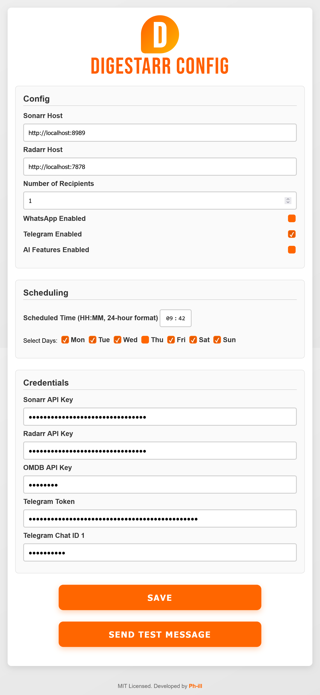

<div align="center">
  
  <h1>Digestarr</h1>
</div>

**Digestarr** is a Python-based tool that compiles and sends daily media digests about new TV shows and movies sourced from Sonarr and Radarr for your Plex, Jellyfin, or Emby server. With a user-friendly Flask configurator, Digestarr simplifies managing API keys, scheduling updates, and delivering notifications via Telegram and WhatsApp (using [ChatMeBot](https://chatmebot.com)).

---

## Features

- **Daily Media Digest:** Automatically compiles and sends daily digests of new media content.
- **Flexible Scheduling:** Set specific days and times for sending the digest.
- **Multi-Channel Messaging:** Receive notifications via Telegram and WhatsApp.
- **User-Friendly Configurator:** Easily manage configuration, API keys, and scheduling.
- **Future Enhancements:** Planned features include AI-driven personalized summaries, recommendation engines, and expanded messaging options.

---

## Installation

### Prerequisites

- Python 3.8 or higher
- Git (optional)

### Downloading the Code

#### Using Git

```bash
git clone https://github.com/yourusername/Digestarr.git
cd Digestarr
```

#### Download as ZIP

1. Navigate to the [Digestarr GitHub repository](https://github.com/yourusername/Digestarr).
2. Click the green **Code** button.
3. Select **Download ZIP**.
4. Extract the downloaded ZIP file.

### Setting Up the Virtual Environment

1. **Create a Python Virtual Environment:**

    ```bash
    python -m venv venv
    ```

2. **Activate the Virtual Environment:**

    - On macOS/Linux:

      ```bash
      source venv/bin/activate
      ```

    - On Windows:

      ```bash
      venv\Scripts\activate
      ```

3. **Install Dependencies:**

    ```bash
    pip install -r requirements.txt
    ```

---

## Usage

### Running the Configurator

Digestarr’s configurator is a Flask-based web interface that lets you configure media hosts, API keys, credentials, and scheduling.

1. **Start the Configurator:**

    ```bash
    bin/python config_editor.py
    ```

2. **Access the Interface:**

    Open your browser and navigate to `http://<SERVER_IP>:5000` (replace `<SERVER_IP>` with your server's IP address).

3. **Configure Your Settings:**

   - Enter your Sonarr and Radarr host addresses and specify the number of recipients.
   - Enable Telegram and/or WhatsApp (WhatsApp messages are sent using [ChatMeBot](https://chatmebot.com)).
   - Provide the necessary API keys (Sonarr, Radarr, Mistral, OMDB, Telegram, etc.).
   - Set the scheduled time (e.g., `09:38`) and select the days for the digest.
   - Use the **Send Test Message** button to verify your configuration in real time.

4. **Save Configuration:**

   Click **Save** to update your `.env` files. The scheduler will then use these settings to run `main.py` at the scheduled times.

---

## Screenshots

### Configurator Interface



### Telegram Message Example

Below is an example Telegram message received from Digestarr:


---

## How It Works

- **Scheduling:** Digestarr uses APScheduler (via the Flask configurator) to read scheduling settings (`SCHEDULE_TIME` and `SCHEDULE_DAYS`) from your `.env` file. At the specified time(s), it executes `main.py` to fetch media data, compose a digest, and send notifications.
- **Messaging:** Notifications are delivered via Telegram and WhatsApp (using ChatMeBot).
- **Logging:** Console logs provide insight into scheduler initialization and job execution for troubleshooting.

---

## Roadmap

### Current Features

- Web-based configurator for managing API keys, credentials, and scheduling.
- Scheduled execution of `main.py` to send daily media digests.
- Integration with Sonarr, Radarr, Telegram, and ChatMeBot for WhatsApp messaging.

### Upcoming Improvements

- Enhanced AI capabilities: Personalized summaries and recommendation engines.
- Expanded messaging platforms.
- More robust logging (console and file).

### Known Issues

- Occasional timing discrepancies in content updates.
- Additional UI enhancements for configuration fields.

---

## License

Digestarr is released under the [MIT License](LICENSE).

---

## Contributing

Contributions are welcome! Feel free to fork the repository and submit pull requests for improvements or bug fixes.

*Note: Git is not required to run Digestarr—you can also download the source code as a ZIP from GitHub and follow the installation instructions above.*